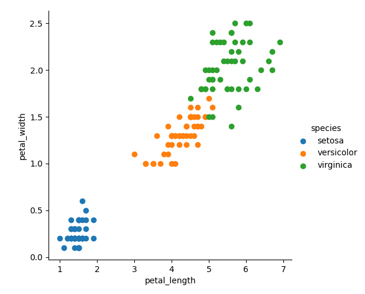
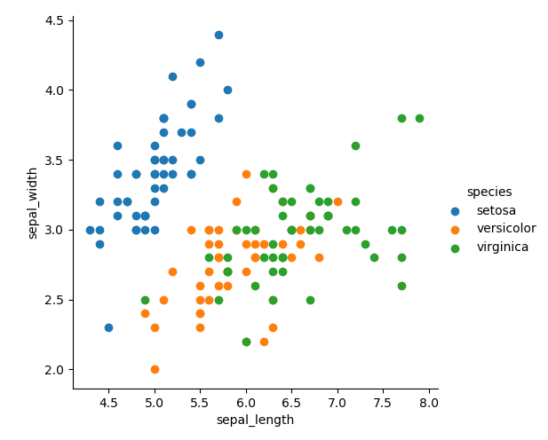

# Iris Dataset Project 2019
This repository contains an explanation and exploration of the famous Iris Dataset as part of the assessment in the  Programming and Scripting module for the Higher Diploma on Data Analytics with Galway-Mayo Institute of Technology.
 

## The Dataset
The Iris Dataset (ID) is comprised of the petal and sepal measurements (length and width) of three different species of iris flower, setosa, versicolor and virginica. 

The data was collected by Edgar Anderson and used by biologist and statistician Ronald Fisher in his 1936 paper *The Use of Multiple Measurements in Taxonomic Problems* to demonstrate how statistics can be used for classification.

Slight discrepancies have been noted in some electronic versions of the dataset (Bezdek et al, 1999) with slight variations observed in some of the measurements when compared to the original dataset that was published in 1936.
 
iris.csv taken from [here](https://gist.github.com/curran/a08a1080b88344b0c8a7#file-iris-csv-L1).

See what is available in this article: https://link.springer.com/chapter/10.1007/978-3-7908-1883-3_19

Why the iris dataset?
- There are no missing values in the dataset.
- It has a balanced class distribution with exactly 50 of each species measured.
- Each of the four features (sepal and petal length and width) are measured in the same way (cm).

It is often used as an example of machine learning because prediction is easy

## Exploratory Data Analysis
https://medium.com/@harimittapalli/exploratory-data-analysis-iris-dataset-9920ea439a3e
Exploratory Data Analysis allows us to better understand the data through statistical and visual techniques in order to form hypotheses

## Averages
Simply observing the averages of each measurement by species seems to demonstrate significant differences between the species. For instance, setosa has the smallest sepal length, petal length and petal width measurements and yet the largest sepal widths.
None of the species individual averages are close to the overall average for all species.

## Standard Deviation
How close measurements are the to average - how wide is the bell curve? Is there even a bell curve? Is the data normally distributed?

## Visualising the Data
Data visualisation helps us to identify interesting aspects of the data in a more clean and efficient manner than just looking at numbers.

Univariate plots help us to understand each individual attribute (e.g. histograms, box plots while multivariate allows us to visualise the relationships between the attributes (e.g. scatter plots). https://machinelearningmastery.com/machine-learning-in-python-step-by-step/

### Scatterplots
The scatterplots show how sepal and petal lengths and widths relate to one another. 

The scatterplots show how one species of iris, the Setosa, is almost entirely distinct from the other two species. A straight line could be drawn to separate the sepal and petal measurements of Setosa from those of the other species, and this difference is particularly evident with petal measurements. 

If one sees an iris with short, narrow petals and short but wide sepals, it could be reliably predicted that the particular species is Setosa.  

Versicolor and Virginica are not very distinguishable from one another in terms of sepal measurements but looking at the petal data, Virginica irises seem more likely to have longer, wider petals than Versicolor.

The histograms and scatterplots shown in the pairplot, allow us to se at a glance how separable the setosa data is from the other two iris species across all measurements. 
While iris versicolor and virginica are not as distinct from one another, the pairplots show that they are more separable by petal measurements than sepal measurements. 

## Correlations
Correlation figures demonstrate that petal length and petal width are both highly correlated with sepal length
Petal length and width are very highly correlated
However, sepal length and width have a small negative correlation.

## Machine Learning
The patterns identified in the iris dataset can be used to create a predictive algorithm to determine the species of iris flower based on sepal and petal measurements.

For machine learning, one must split the dataset into training data and test data
Swain et al (2012) used 75 for training and 75 for testing
https://www.kaggle.com/sharmajayesh76/iris-data-train-test-split also halves the data
https://machinelearningmastery.com/machine-learning-in-python-step-by-step/ 80% training, 20% testing
https://python-guide-kr.readthedocs.io/ko/latest/scenarios/ml.html 140 for training, 10 for testing
https://www.kaggle.com/kamrankausar/iris-dataset-ml-and-deep-learning-from-scratch 70% training, 30% testing

Not sure if I should go into the Machine Learning side of things
Requires scikit knowledge
This is a nice intro https://python-guide-kr.readthedocs.io/ko/latest/scenarios/ml.html
More complex https://www.kaggle.com/sharmajayesh76/iris-data-train-test-split
https://www.ritchieng.com/machine-learning-iris-dataset/
https://www.kaggle.com/kamrankausar/iris-dataset-ml-and-deep-learning-from-scratch

## Exploring the Data
Python Libraries
- pandas
- matplotlib
- seaborn
- numpy
- sklearn
Visual Studio Code
Jupyter Notebook - for clean image output

While pandas was used to describe and explore the dataset, it needs to be expressed as a numpy array in order to demonstrate a machine learning algorithm.

## References
Bezdek, J. C., Keller, J. M., Krishnapuram, R., Kuncheva, L. I., & Pal, N. R.       (1999). *Correspondence: Will the Real Iris Data Please Stand Up?*. IEEE        Transactions on Fuzzy Systems, 7: 3, June 1999.

Swain, M., Dash, S. K., Dash, S., & Mohapatra, A. (2012). *An Approach for Iris     Plant Classification Using Neural Network*. International Journal on Soft       Computing, 3: 1, February 2012. 

# Notes
Wiki:
Quantifies the morphology (structural features) of three related species of iris flowers
Multivariate data set - more than 2 variables per observation
Linear Discriminant Analysis / Fisher's Linear Discriminant - a linear combination that characterises/separates two or more classes of objects.

Try working through this tutorial to explore dataset: https://machinelearningmastery.com/machine-learning-in-python-step-by-step/
A machine learning project may not be linear, but it has a number of well known steps:
1. Define Problem.
2. Prepare Data.
3. Evaluate Algorithms.
4. Improve Results.
5. Present Results.

The best small project to start with on a new tool is the classification of iris flowers (e.g. the iris dataset). This is a good project because it is so well understood.
* Attributes are numeric so you have to figure out how to load and handle data.
* It is a classification problem, allowing you to practice with perhaps an easier type of supervised learning algorithm.
* It is a multi-class classification problem (multi-nominal) that may require some specialized handling.
* It only has 4 attributes and 150 rows, meaning it is small and easily fits into memory (and a screen or A4 page).
* All of the numeric attributes are in the same units and the same scale, not requiring any special scaling or transforms to get started.

Look at the dataset in terms of: 
* Classification - organising data by categories
* Linear discriminant analysis 
* Clustering
* Data visualisation - graphs
* Pattern recognition - species could be predicted based on data measurements
* Machine learning such as neural networks - predictive nature of the data 