# Iris Dataset Project 2019
This repository contains an exploration of the famous Iris Dataset as part of the assessment in the  Programming and Scripting module for the Higher Diploma in Data Analytics with Galway-Mayo Institute of Technology.

## 1. About this Repository
The repository is available [here](https://github.com/jennifer-ryan/iris-data-set-project) and made up of the following files and folders:
* A **README** file that contains descriptions of the Iris Dataset, exploratory data analysis using statistics and data visualisation, and a very basic illustration of how the dataset can be used in machine learning.
* The **iris.csv** file which contains the complete dataset downloaded from [here](https://gist.github.com/curran/a08a1080b88344b0c8a7#file-iris-csv-L1). 
    * This file is used for the exploratory data analysis portion of the project and is read through *pandas*. The Iris Dataset available in the *scikit-learn* library is used for the machine learning section and read as a *numpy* array.
    * Note that there have been slight discrepancies observed in some electronic versions of the dataset with small variations observed when compared to the original dataset that was published in 1936 ([Bezdek et al, 1999](https://pdfs.semanticscholar.org/1c27/e59992d483892274fd27ba1d8e19bbfb5d46.pdf)) but these potential differences are not substantial enough to have any major effect on the overall patterns of the data.
* Two **Jupyter Notebooks** created using Python: 
    * **Iris Dataset Exploratory Data Analysis** uses the *pandas* library for statistical investigations and *matplotlib* and *seaborn* for data visualisation.
    * **Machine Learning** that interprets the dataset as *numpy* arrays and builds a basic model using *scikit-learn*, specifically the *k-nearest neighbor* (KNN) algorithm. 
* A short Python program, **test_parameters.py**, designed to determine the best *train_test_split* ratio and *k* value for KNN. 
* **Images** folder that contains .png files of the outputs of the code from the exploratory data analysis notebook that are embedded for description purposes in this README. 

## 2. Python Coding Methodology
As a novice in the Python programming language, this project challenged me to become familiar with several new libraries that have been widely used to investigate the Iris Dataset. For the exploratory portion of the project, I learned the basics of using the *pandas* library to examine datasets ([Lynn, 2018](https://www.shanelynn.ie/using-pandas-dataframe-creating-editing-viewing-data-in-python/); [Mester, 2018](https://data36.com/pandas-tutorial-1-basics-reading-data-files-dataframes-data-selection/); [Pandas-Docs](https://pandas.pydata.org/pandas-docs/stable/getting_started/10min.html)) as it is an excellent tool for data manipulation and statistics that is relatively easy to learn. To create graphs, I used a mixture of *matplotlib* and a derivative of it called *seaborn*, which creates more attractive graphs ([Kumar, 2018](https://www.kaggle.com/rakesh6184/seaborn-plot-to-visualize-iris-data); [Mendis, 2019](https://www.kdnuggets.com/2019/04/data-visualization-python-matplotlib-seaborn.html); [Rathod, 2017](https://github.com/venky14/Machine-Learning-with-Iris-Dataset/blob/master/Iris%20Species%20Dataset%20Visualization.ipynb)).

The machine learning portion of the project uses *scikit-learn* which is built to interpret a dataset as a *numpy* array rather than through *pandas*. *Scikit-learn* is a very powerful but quite a complex library - at least to a beginner - so I used several resources in an attempt to understand some of its basic functionality ([Codesbay, 2018](https://www.youtube.com/watch?v=hd1W4CyPX58&); [Markham, 2018](https://github.com/justmarkham/scikit-learn-videos/blob/master/04_model_training.ipynb); [Ng, 2019](https://www.ritchieng.com/machine-learning-iris-dataset/#)). For the purposes of this investigation, I attempted to create a very basic illustration of a potential machine learning program using the *k-nearest neighbors* algorithm, which, as a new user, I found the most accessible. 

Rather than presenting the code generated for this project as a series of .py files, I decided to learn how to use *Jupyter Notebooks* for code presentation as output is presented in a much cleaner fashion and is altogether more legible.

## 3. The Dataset
The Iris Dataset consists of 50 samples each of three different species of iris flower: setosa, versicolor and virginica. It contains four different measurements for each sample in centimetres - the length and width of sepals and petals - making it a multivariate dataset.

The data was collected by botanist Edgar Anderson in the Gaspé Peninsula and popularised when it was used by biologist and statistician Ronald Fisher in his 1936 paper *The Use of Multiple Measurements in Taxonomic Problems* to demonstrate how statistics can be used for classification. He argues that, based on some significant attribute differences between the species in this dataset, iris group membership could potentially be determined by sepal and petal measurements alone - a method that would become known as linear discriminant analysis. From here it is postulated that new iris flowers could be classified based on the statistical information gleaned from the dataset. 

The Iris Dataset remains a popular example as an introduction to exploratory data analysis, pattern recognition, and machine learning algorithms for the following reasons ([Brownlee, 2016](https://machinelearningmastery.com/machine-learning-in-python-step-by-step/)):
* It is a complete, balanced dataset in that there are no null values and each class is equally represented. 
* Each of the four features (sepal and petal length and width) are measured in the same units (centimetres).
* One iris species (setosa) is linearly separable from the other two. While the other species have some overlap, they are still largely distinguishable from one another in certain measurements. Thus, classification is relatively easy and, by extension, the predictive capability of the data is quite strong. 

## 4. Exploratory Data Analysis
*See Jupyter Notebook entitled **Iris Dataset Exploratory Analysis** for the code.*

Exploratory Data Analysis allows us to better understand the data through statistical and visual analysis in order to form hypotheses and uncover potential patterns in the data ([Douieb, 2017](https://www.quora.com/What-are-the-steps-include-in-data-exploration)). For this portion of the project, I will be using *pandas* to read the dataset and perform statistical investigations and a mixture of *matplotlib* and *seaborn* to illustrate patterns.
 
Generally, the first things to look at when confronted with a new dataset are the structure of the dataset and basic information about its contents ([Brownlee, 2016](https://machinelearningmastery.com/machine-learning-in-python-step-by-step/); [Kadam, 2017](https://github.com/ashKadam/IrisDataAnalysis/blob/master/Iris.py); [Mittapalli, 2018](https://medium.com/@harimittapalli/exploratory-data-analysis-iris-dataset-9920ea439a3e); [Ng, 2019](https://www.ritchieng.com/machine-learning-iris-dataset/#)). *Pandas* allows us to see that the dataset is comprised of 150 rows and 5 columns; 4 of these columns are float datatypes containing the petal and sepal measurements and the last one is an object datatype that contains the species names. There are no null values in the dataset that need to be accounted for in later analysis. We can also see that the dataset is well balanced with each species accounting for 50 samples.

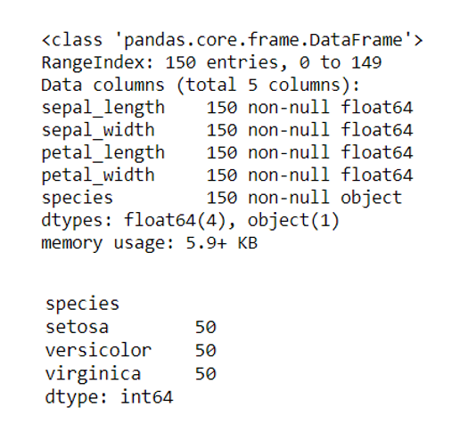

Below is a sample of 10 entries in the Iris Dataset:

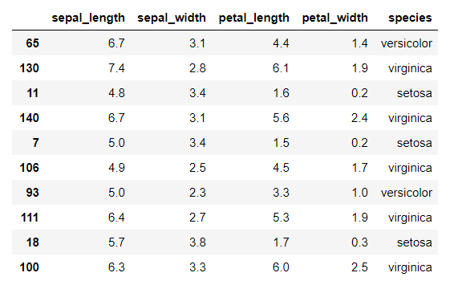

### 4.1 Basic Statistics
The *describe* function in *pandas* shows some basic statistics such and means, standard deviations and medians. 

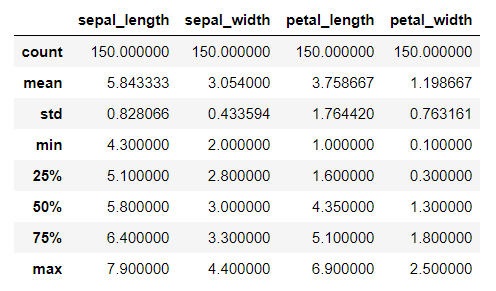

From these figures we can see the following:
* Mean values show that sepal and petal lengths are larger than their respective width measurements and that sepals run larger than petals. So, if we had never seen an iris flower before, we can assume from these figures that petals are smaller than sepals and that both are generally longer than they are wide.
* The mean and median values of both sepal measurements are quite similar and the low standard deviations ([CV < 1](https://www.researchgate.net/post/What_do_you_consider_a_good_standard_deviation)) suggest this data may be quite clustered together with datapoints relatively close to the mean. 
* On the other hand, the mean and median values of both petal measurements are not as close and petal standard deviations are slightly higher than their sepal counterparts, suggesting that there is more variance in the petal data.
* The previous two observations suggest that any differences between iris species may be more likely related to petal features rather than sepal.

### 4.2 Data Visualisation
It may be beneficial at this stage to visualise the data and the relationships between measurements to see if any patterns emerge. For this I utilised a *seaborn* pair plot ([Kadam, 2017](https://github.com/ashKadam/IrisDataAnalysis/blob/master/Iris.py); [Mittapalli, 2018](https://medium.com/@harimittapalli/exploratory-data-analysis-iris-dataset-9920ea439a3e); [Rathod, 2017](https://github.com/venky14/Machine-Learning-with-Iris-Dataset/blob/master/Iris%20Species%20Dataset%20Visualization.ipynb)) which pairs every feature with every other feature, distinguished by object-type. A pair plot outputs a mixture of two-dimensional scatter plots, that show the relationships between measurements, and univariate histograms that show the distribution of each measurement separated by species.

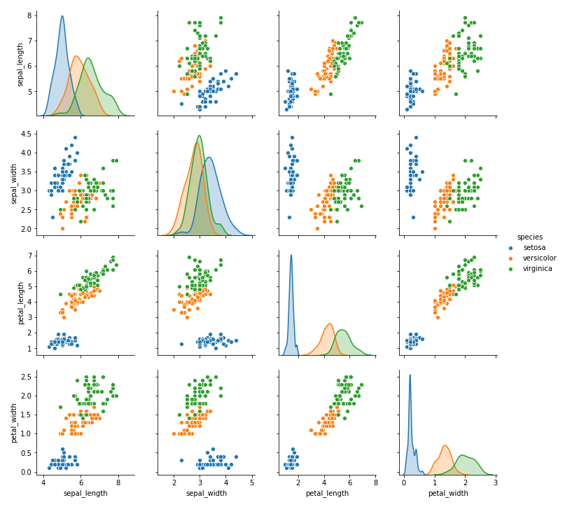 

Straightaway we can see that iris setosa (blue) appears visually to be quite separate from the other two species in virtually all scatter plot feature combinations, but most drastically in petal measurements. While there is quite a bit of observable overlap between versicolor (orange) and virginica (green), particularly in terms of sepal measurements, setosa appears to be significantly linearly distinct. Petal length and width and sepal length in the setosa are significantly smaller than those of either versicolor or virginica, as we can see in the histograms where the setosa data is much closer to the left of each graph.    

Also, although versicolor and virginica are not cleanly distinct from one another, again the petal measurements demonstrate a pattern with virginica tending to have longer and wider petals than versicolor. Sepal measurements for these species are much more clustered when examined alone but when paired with petal measurements, distinctions can be seen as those with larger petals seemingly tend to also have larger sepals.

To see how each measurement is distributed by species, a box plot ([Brownlee, 2016](https://machinelearningmastery.com/machine-learning-in-python-step-by-step/)) or violin plot ([Mittapalli, 2018](https://medium.com/@harimittapalli/exploratory-data-analysis-iris-dataset-9920ea439a3e)) could be used but I prefer the similar but more legible swarm plot ([Kumar, 2018](https://www.kaggle.com/rakesh6184/seaborn-plot-to-visualize-iris-data)).

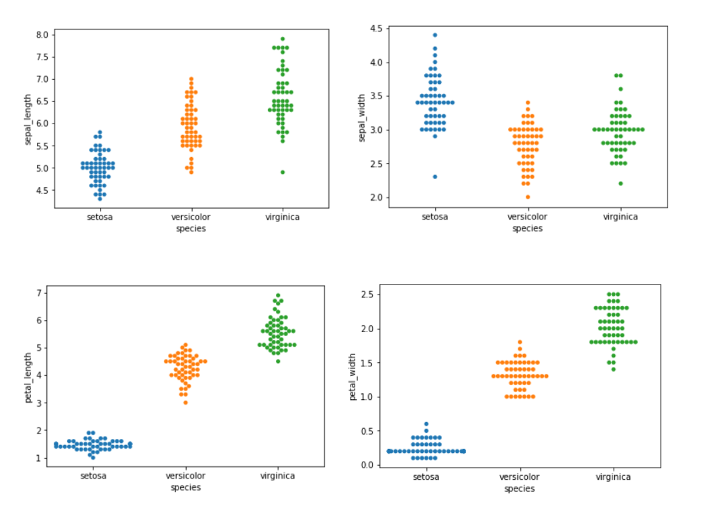

The swarm plots above demonstrate distribution differences between petal and sepal values. Petal measurements occupy a much smaller range per species than sepal measurements, which are more spread out. The larger distribution of sepal measurements means there are more outliers and thus more chances for the data to overlap between species, making classification based on sepal measurements more difficult. This, along with the density of petal data, provides further support to the hypothesis from the previous section that suggests the distinctions between species are likely petal-based rather than sepal-based. 

### 4.3 Correlations
It appears that a distinction exists between petal and sepal measurements so perhaps there is some internal consistency within them. The *pandas correlation* function tells us more about this:

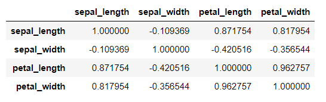

Here we can see that:
* Petal length and width are very highly positively correlated (r = 0.96), which tells us that as one gets larger so does the other, indicating that petal length and width have a close relationship.
* On the other hand, sepal measurements have a very weak relationship with one another (r = -0.1).
* Both petal length and width have very strong positive correlations with sepal length (r = 0.87 and 0.82 respectively) indicating that as both get larger, so does sepal length.
* Both petal length and width have fairly weak negative correlations with sepal width (r = -0.42 and -0.36 respectively) indicating there is not much of a relationship between these features. 
* These correlations tell us that sepal width is not moderately or highly correlated with any other measurement.

The correlations can be visualised more easily on the below heatmap ([Kausar, 2018](https://www.kaggle.com/kamrankausar/iris-dataset-ml-and-deep-learning-from-scratch/notebook)). The large amount of red and orange squares show that the majority of measurements are highly correlated with one another, except for sepal width.

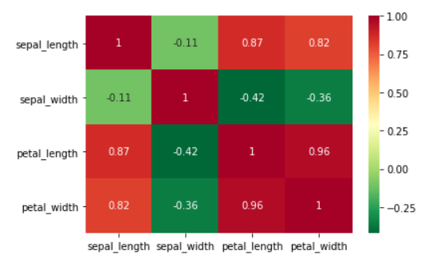

### 4.4 Univariate Analysis
Much of the previous analysis looked at the data overall so this section will take a closer look at each species individually (univaraite analysis) to see if we can further account for species distinction. For this, I split the Iris Dataset into three separate dataframes, one for each species ([Lynn, 2018](https://www.shanelynn.ie/select-pandas-dataframe-rows-and-columns-using-iloc-loc-and-ix/)).

#### 4.4.1 Overall Descriptors
First I look at the same overall descriptions as in section 4.1, but this time separated by species.
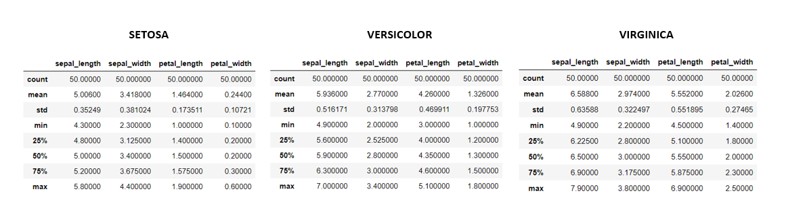

Observing each measurement by species again demonstrates significant differences between them:
* Setosa has the smallest average sepal length, petal length and petal width and yet the largest average sepal width.
* Minimum sepal width values appear fairly aligned across species but the setosa has the largest range at 2.1cm versus 1.4cm for versicolor and 1.6cm for virginica. However, taking a look back at the swarm plot in section 4.2 shows that the minimum sepal width value of setosa is an outlier and the minimum value is generally closer to 3cm. This may account for the previously observed weak correlations between sepal width and every other measurement (section 4.3) as setosa seems to buck the trend by being smallest in all measurements except for sepal width. 
* Interestingly, setosa petals are so much smaller than those of the other two species that its maximum petal measurements are still significantly smaller than the minimum petal measurements of either versicolor or virginica, suggesting a very large difference between setosa and the other two flower species in terms of petal size.
* Virginica is on average larger than versicolor in all measurements, indicating that it is generally a bigger flower.
* Looking at the minimum and maximum sepal measurements of versicolor and virginica shows they are quite closely aligned indicating considerable overlap in these values. Differences are more pronounced with petal measurements but there remains some amount of overlap which demonstrates that these species cannot be linearly separated. 
* Overall the differences between species again seems much more pronounced for petal measurements than sepal measurements. 

Looking a little more closely at the mean values of each species and comparing them to those observed for the entire dataset, shows that each species is distinct in these measurements when compared to overall averages and no one species could be deemed representative of the entire dataset. Standard deviations are also much smaller across all measurements for individual species than the overall standard deviations, suggesting that each species is more internally consistent than the dataset measurements as a whole.

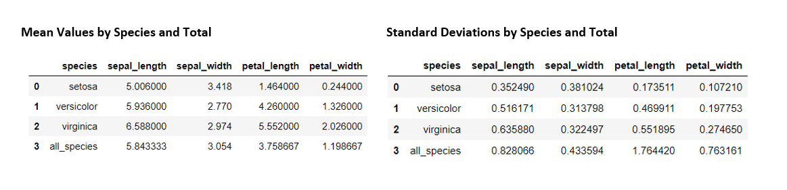

#### 4.4.2 Visualising Univariate Data
While multivariate plots allow us to visualise the relationships between the attributes, univariate plots help us to understand each individual attribute ([Brownlee, 2016](https://machinelearningmastery.com/machine-learning-in-python-step-by-step/)). The histograms below show how the measurement data is represented across each species.

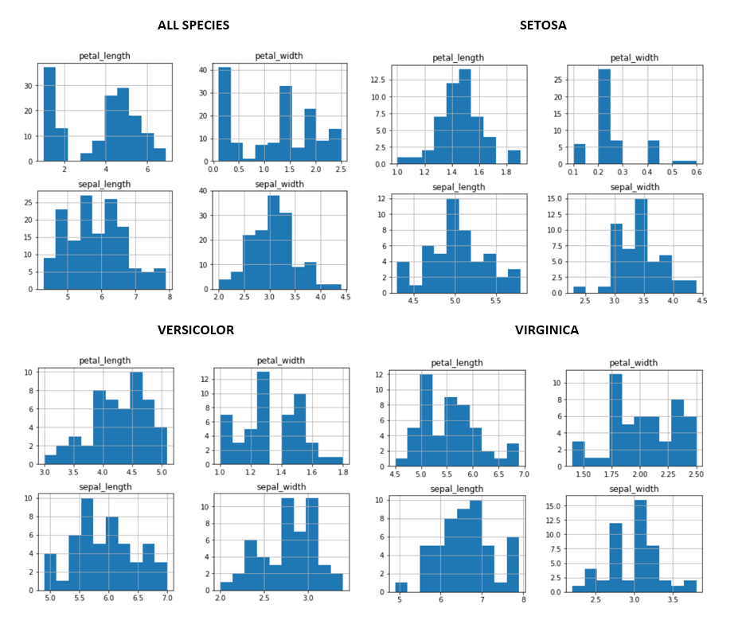

Again this demonstrates how the data within each species is distributed differently to the dataset as a whole. The data seems to skew more towards a normal distribution for sepal measurements than petal measurements across the board. This likely accounts for iris species being more easily separable by petal rather than sepal measurements. The non-normality of petal values, particularly in the 'ALL SPECIES' histogram, shows how drastically different setosa petal measurements are from the other two species. But this may also be related to the very small range of petal width values: in setosa there is only 0.5cm between the minimum and maximum measurements, 0.8cm for versicolor and 1.1cm for virginica. 

#### 4.4.3 Correlations
Unusually, while the overall correlations discussed in section 4.3 suggest much of the data is closely related, the same cannot be said when the measurements are split by species.

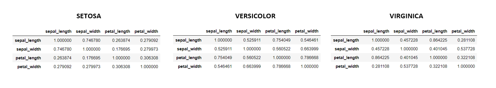
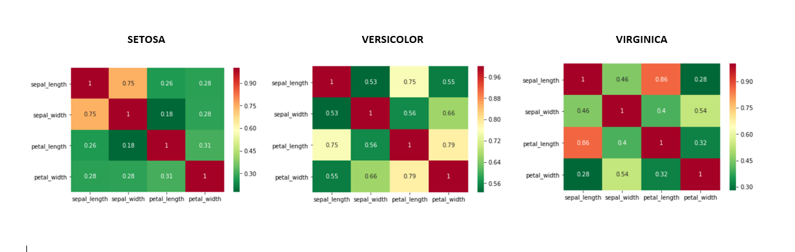

* While the overall dataset showed a massive positive correlation between petal length and width (r = 0.96), versicolor is the only species that maintains a high correlation (r = 0.79). Both setosa (r = 0.31) and virginica (r = 0.32) have much lower petal width to length correlations. 
* On the other hand, the very weak negative correlation observed between overall sepal length and width (r = -0.11), is improved and has become positive. Setosa has strong positive sepal correlations (r = 0.75), while versicolor (r = 0.53) and virginica (r = 0.46) have moderate positive correlations. It is possible that the weak correlation initially observed in sepal values is due to iris setosa, which is largest in average sepal width measurements while being smallest across all other features.
* In the initial correlations, petal length (r = 0.87) and width (r = 0.82) demonstrated strong positive correlations with sepal length. With the individual species, petal width and sepal length maintain weak positive correlations in setosa (r = 0.28) and virginica (r = 0.28) and a moderate positive correlation in versicolor (r = 0.55). Petal and sepal lengths are still highly correlated in versicolor (r = 0.75) and virginica (r = 0.86) but again a very weak correlation is observed with setosa (r = 0.26).

Some of these correlation discrepancies could be due to systematic differences between flowers, i.e. in the whole population as some features get bigger, the others tend to also grow but the same cannot be said for individual species ([Nicholls, 2014](https://www2.mrc-lmb.cam.ac.uk/download/lectures/lmb_statistics_course_2014/tutorial_answers/Tutorial_2_Descriptive_statistics_and_exploratory_data_analysis_answers.pdf)). However, these changes also demonstrate [Simpson's Paradox](https://en.wikipedia.org/wiki/Simpson%27s_paradox), which is a phenomenon in statistics whereby trends observed in the whole population can disappear or reverse when the population is broken down by category. Identification of this paradox and the reasons behind its occurrence can be quite complex ([Xu et al, 2018](https://aaai.org/ocs/index.php/FLAIRS/FLAIRS18/paper/download/17641/16887)).

## 5. Machine Learning
*See Jupyter Notebook entitled **Machine Learning** for the code.*

The patterns identified in the exploratory data analysis portion of this project demonstrate why the Iris Dataset is a popular choice for machine learning tutorials; the separability of the species makes the building of a predictive model relatively easy. A machine learning program learns from data provided by previous examples. In the case of the Iris Dataset, this is a supervised learning problem as the example provides both input (iris measurements) and output (iris species) pairs ([Markham, 2018](https://www.youtube.com/watch?v=hd1W4CyPX58&); [Ng, 2019](https://www.ritchieng.com/machine-learning-iris-dataset/)). The information from these pairings should ideally allow us to create a model that can accurately predict a species of iris when presented with new data inputs. 

There are several steps in the construction of a supervised machine learning program that have been outlined well by [Guo (2017)](https://towardsdatascience.com/the-7-steps-of-machine-learning-2877d7e5548e) and which I will address individually below:
1. Data collection.
2. Data preparation.
3. Choose a model.
4. Train the model.
5. Evaluate the model.
6. Parameter tuning
7. Make predictions.

### 5.1 Data Collection.
In this case, I am using a pre-existing dataset and so the data collection step is unnecessary.

### 5.2 Data Preparation.
This involves cleaning up the data, if required - removing errors/duplicates and dealing with null values, which is not necessary with the Iris Dataset - and performing exploratory data analysis, completed in the previous sections. 

It also involves the splitting of the data into a training set and a testing/validation set which is achieved through *scikit-learn*. A portion of the dataset will be used to train the model and a smaller portion will be used to test the resulting model. There is no "correct" training/testing ratio but in general a [70/30 split](https://www.researchgate.net/post/Is_there_an_ideal_ratio_between_a_training_set_and_validation_set_Which_trade-off_would_you_suggest) is adopted. However, this depends on the dataset being used and it is best to test different ratios to see which fits best with the particular dataset and yields the most accurate predictions. Previous models with the Iris Dataset have used a 50/50 split ([Sharma, 2017](https://www.kaggle.com/sharmajayesh76/iris-data-train-test-split)), 60/40 split ([Rajesh, 2018](https://www.kaggle.com/lalitharajesh/iris-dataset-exploratory-data-analysis)), 90/10 split ([Reitz, 2016](https://python-guide-kr.readthedocs.io/ko/latest/scenarios/ml.html)), 80/20 split ([Brownlee, 2016](https://machinelearningmastery.com/machine-learning-in-python-step-by-step/); [Ogundowole, 2017](https://medium.com/codebagng/basic-analysis-of-the-iris-data-set-using-python-2995618a6342)) or 70/30 split ([Kausar, 2018](https://www.kaggle.com/kamrankausar/iris-dataset-ml-and-deep-learning-from-scratch)). In this project, I check both a 70/30 split as it is considered the norm and an 80/20 split as it is used in two of the examples (see section 5.6 where the final parameter is chosen).

The data is split into *x values* that represent the measurements (*iris.data*) and *y values* that represent the species (*iris.target*). These *x* and *y* numpy arrays are then split into training (*x_train*, *y_train*) and testing (*x_test*, *y_test*) sets and the *test_size* is set to 0.2/0.3.

### 5.3 Choose a Model
*Scikit-learn* is a popular Python library used for creating machine learning models. Indeed, all of the previous Iris Dataset machine learning models referenced in this project use *scikit-learn*. There are several algorithms available in this library that can be used to build a machine learning model for the Iris Dataset including:
* Logistic Regression
* Linear Discriminant Analysis
* K-Nearest Neighbors
* Classification and Regression Trees 
* Gaussian Naive Baynes
* Support Vector Models

Some previous examples have tested each model for accuracy before settling on one or more for their own models ([Brownlee, 2016](https://machinelearningmastery.com/machine-learning-in-python-step-by-step/); [Kauser, 2018](https://www.kaggle.com/kamrankausar/iris-dataset-ml-and-deep-learning-from-scratch); [Ogundowole, 2017](https://medium.com/codebagng/basic-analysis-of-the-iris-data-set-using-python-2995618a6342)) and, because the dataset has such excellent predictive characteristics, they all rank quite high, between 96%-99% accuracy.

For the purposes of the current investigation, I will be using the *k-nearest neighbors* (KNN) model to illustrate how one may go about constructing a machine learning model as I found it the most accessible tool to understand and utilise and there are many previous examples that demonstrate its application to the Iris Dataset ([Brownlee, 2016](https://machinelearningmastery.com/machine-learning-in-python-step-by-step/); [Kausar, 2018](https://www.kaggle.com/kamrankausar/iris-dataset-ml-and-deep-learning-from-scratch); [Ogundowole, 2017](https://medium.com/codebagng/basic-analysis-of-the-iris-data-set-using-python-2995618a6342); [Rajesh, 2018](https://www.kaggle.com/lalitharajesh/iris-dataset-exploratory-data-analysis); [Sharma, 2017](https://www.kaggle.com/sharmajayesh76/iris-data-train-test-split)).

### 5.4 Train the Model: K-Nearest Neighbor (KNN) 
KNN can be used for classification prediction models and so is fitting for the Iris Dataset. A KNN model is built with a dataset that contains input features and output labels and, when presented with new data, uses Euclidean Distance to measure the distance between the new data points and a certain number of established data points. The number of data points, called *k*, can be adjusted based on the size of the dataset. If the majority of established data points nearest the new data point match a particular label, the model will ascertain that the new data presented belongs to that label. 

The image below demonstrates a KNN classification that checks two different *k* values. In the first instance (k = 3) the model would check the 3 nearest neighbours and determine that the new data point belongs to Class B. However, if it is expanded (k = 7), allowing the model to check the 7 nearest neighbours, the new data point is likely to belong to Class A.

There is [no single ideal value for k](https://discuss.analyticsvidhya.com/t/how-to-choose-the-value-of-k-in-knn-algorithm/2606/13) that makes predictive models more accurate. It is advisable to try different values for *k* to see what returns the most accurate  (see section 5.6). However, it is generally better to make the value of *k* an odd number rather than an even number as this lowers the chance of there being an equal number of data point neighbours that could cause conflict ([Codesbay, 2018](https://www.youtube.com/watch?v=kzjDUr-7uRw)) - with odd numbers there will always be a clear choice.

The KNN *fit* function trains the model with the data made available in the *x_train* and *y_train* arrays. The resulting model is then passed through the *predict* function, which inputs the the *x_test* data and outputs an array of values that represent the model's prediction of the iris species. 

### 5.5 Evaluate the Model
This prediction made in the testing portion of the model is evaluated using the *accuracy_score* function that is available through the *metrics* module of the *scikit-learn* library ([Brownlee, 2016](https://machinelearningmastery.com/machine-learning-in-python-step-by-step/); [Kausar, 2018](https://www.kaggle.com/kamrankausar/iris-dataset-ml-and-deep-learning-from-scratch/notebook)). The *y_test* data is compared with the output of the *predict* function to see if the resulting array correctly matches the species type. 

In this project, the *accuracy_score* changes each time the Jupyter Notebook is run. This is because, while KNN is useful as an introduction to machine learning models, it does not, strictly speaking, create a complete independent model that is trained to interpret data. It runs through the entire dataset for each and every prediction meaning it [consumes a lot of time and space](https://stackoverflow.com/questions/10814731/knn-training-testing-and-validation). However, for the purposes of the current investigation, it serves to provide a simple illustration of a very basic machine learning method.

### 5.6 Parameter Tuning
As mentioned previously, I planned to check two different ratios when splitting the data into training and testing sets: 70/30 and 80/20. I also indicated that the best *k* value for the KNN algorithm would need to be determined. To do this I wrote a short program (*test_parameters.py*) that iterates through the KNN model from *train_test_split* to *accuracy_score* using the different combinations of *test_size* and *k* values. The results were amalgamated into the tables below: 

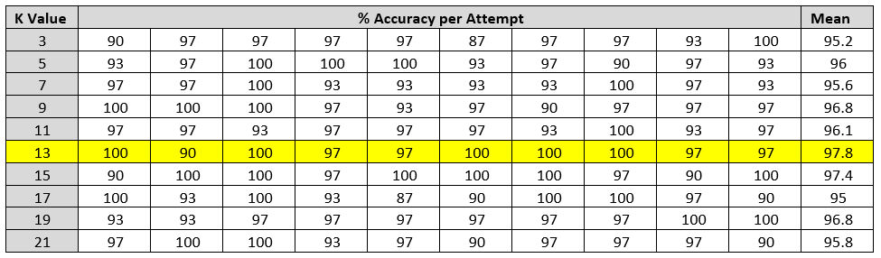

In both *test_size* cases, even though accuracy is generally high across the board (>93%), a *k* value of 13 yields the most accurate average percentage of over 97%. The difference between a *test_size* of 20% and 30% appears neglibible with only 0.2% difference in the average accuracy percentage. It was thus decided that for the current investigation, the data would be split into an 80/20 training/testing ratio and the *k* value would be 13.

### 5.7 Make Predictions
The KNN model can be further tested by passing new data through it. For this, I created a numpy array of 6 hypothetical iris measurements. The first 3 are the mean values and the last 3 are the maximum values of setosa, versicolor and virginica respectively. The KNN model correctly identified 5 out of 6 species, mistaking the 5th versicolor measurement as a virginica. As this was the maximum values of a versicolor and the previous exploratory data analysis identified some overlap between these species (larger versicolor petal measurements align well with smaller virginica petal measurements and sepal measurements are very clustered across both species), it is understandable that there would be errors in distinguishing these flowers. A look at the scatter plots below shows the overlap for versicolor and virginica species:

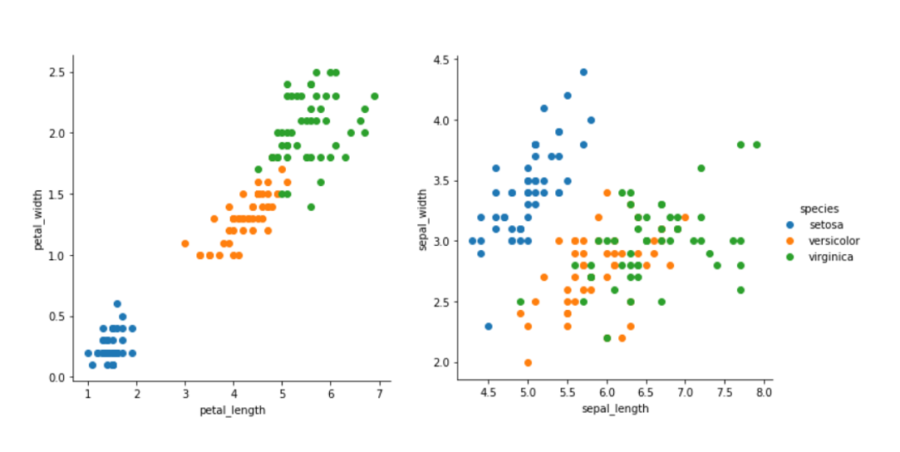

Thus it could be said that the accuracy of the KNN model for the Iris Dataset is affected more by versicolor and virginica classification as they are not linearly separable. 

## 6. Conclusion
The exploratory data analysis performed in this investigation uncovered many interesting details about the iris dataset but the main points of note are:
* Iris setosa is linearly distinguishable from both versicolor and virginica. 
    * If measurements are presented of an iris with short, narrow petals and short but wide sepals, it could be reliably predicted that the particular species is setosa.
* Species differentiation largely depends more on petal measurements than sepal measurements.
    * Versicolor and virginica are not very distinguishable from one another in terms of sepal measurements but looking at the petal data, virginica irises seem more likely to have longer, wider petals than versicolor. 

The basic KNN model above would then be expected to have little issue identifying setosa flowers but may encounter errors with versicolor and virginica differentiation, as seen in section 5.7. Prediction could be improved with more robust models but that is beyond the scope of the current investigation, which only aims to provide an overview of the Iris Dataset and how it can potentially be used as a machine learning model.   
 

## 7. References
Bezdek, J. C., Keller, J. M., Krishnapuram, R., Kuncheva, L. I., & Pal, N. R. (1999) *Correspondence: Will the Real Iris Data Please Stand Up?*. IEEE Transactions on Fuzzy Systems, 7: 3, June 1999. https://pdfs.semanticscholar.org/1c27/e59992d483892274fd27ba1d8e19bbfb5d46.pdf

Brownlee, J. (2016) *Your First Machine Learning Project in Python Step-by-Step.* https://machinelearningmastery.com/machine-learning-in-python-step-by-step/

Codesbay (2018). *Machine Learning 'Hello World' with Scikit Learn: Chapter 5: Using the Iris Dataset.* YouTube. https://www.youtube.com/watch?v=kzjDUr-7uRw

Douieb, I. (2017) *What are the steps included in data exploration?* Quora. https://www.quora.com/What-are-the-steps-include-in-data-exploration

Fisher, R. A. (1936) *The Use of Multiple Measurements in Taxonomic Problems.* Annals of Eugenics, 7.2. 

Guo, Y. (2017) *The 7 Steps of Machine Learning.* Towards Data Science. https://towardsdatascience.com/the-7-steps-of-machine-learning-2877d7e5548e

Kadam, A. (2017) *Iris Data Analysis*. GitHub Repository https://github.com/ashKadam/IrisDataAnalysis/blob/master/Iris.py

Kausar K. (2018) *Iris Dataset ML and Deep Learning from Scratch.* Kaggle Notebook. https://www.kaggle.com/kamrankausar/iris-dataset-ml-and-deep-learning-from-scratch/notebook 

Kumar, R. (2018) *  Seaborn Plot to Visualise Itis Dataset.* Kaggle Notebook. https://www.kaggle.com/rakesh6184/seaborn-plot-to-visualize-iris-data

Lynn, S. (2018) *Pandas Tutorials.* https://www.shanelynn.ie/using-pandas-dataframe-creating-editing-viewing-data-in-python/ and https://www.shanelynn.ie/select-pandas-dataframe-rows-and-columns-using-iloc-loc-and-ix/

Markham, K. (2018) *Training a MAchine Learning Model with Scikit-Learn - Video 4.* Github Repository. https://github.com/justmarkham/scikit-learn-videos/blob/master/04_model_training.ipynb and paired Youtube Video https://www.youtube.com/watch?v=hd1W4CyPX58&.

Mendis, A. (2019) *Data Visualization in Python: Matplotlib vs Seaborn.* KDnuggets. https://www.kdnuggets.com/2019/04/data-visualization-python-matplotlib-seaborn.html

Mester, T. (2018). Pandas Tutorial Series. [Part 1](https://data36.com/pandas-tutorial-1-basics-reading-data-files-dataframes-data-selection/), [Part 2](https://data36.com/pandas-tutorial-2-aggregation-and-grouping/), [Part 3](https://data36.com/pandas-tutorial-3-important-data-formatting-methods-merge-sort-reset_index-fillna/).

Mittapalli, H. (2018) *Exploratory Data Analysis.* Medium. https://medium.com/@harimittapalli/exploratory-data-analysis-iris-dataset-9920ea439a3e

Ng, R. (2019) *Iris Dataset.* https://www.ritchieng.com/machine-learning-iris-dataset/#

Nicholls, R. (2014) *Tutorial 2: Descriptive Statisticsand Exploratory Data Analysis Answer Sheet.* https://www2.mrc-lmb.cam.ac.uk/download/lectures/lmb_statistics_course_2014/tutorial_answers/Tutorial_2_Descriptive_statistics_and_exploratory_data_analysis_answers.pdf

Ogundowole, O. O. (2017) *Basic Analysis of the Iris Dataset Using Python.* Medium. https://medium.com/codebagng/basic-analysis-of-the-iris-data-set-using-python-2995618a6342

Pandas-Docs (2019) *10 Minutes to Pandas.* https://pandas.pydata.org/pandas-docs/stable/getting_started/10min.html

Rajesh, L. (2018) *Iris Dataset - Exploratory Data Analysis.* Kaggle Notebook. https://www.kaggle.com/lalitharajesh/iris-dataset-exploratory-data-analysis

Rathod, V. (2017) *Machine-Learning-with-Iris-Dataset: Iris Species Dataset Visualisation.* GitHub Repository. https://github.com/venky14/Machine-Learning-with-Iris-Dataset/blob/master/Iris%20Species%20Dataset%20Visualization.ipynb

Reitz, K. (2016) *Machine Learning.* https://python-guide-kr.readthedocs.io/ko/latest/scenarios/ml.html

Sharma, J. (2017) *Iris Data Train_Test_Split.* Kaggle Notebook. https://www.kaggle.com/sharmajayesh76/iris-data-train-test-split

Xu, C., Brown, S. M. & Grant, C. (2018) *Detecting Simpson'd Paradox.* The Thirty-First International Florida Artifical Intelligence Research Society Conference. https://aaai.org/ocs/index.php/FLAIRS/FLAIRS18/paper/download/17641/16887

### 7.1 Further Links Used:

iris.csv file: https://gist.github.com/curran/a08a1080b88344b0c8a7#file-iris-csv-L1

Iris flowers: https://s3.amazonaws.com/assets.datacamp.com/blog_assets/Machine+Learning+R/iris-machinelearning.png

Coefficient of variable: https://www.researchgate.net/post/What_do_you_consider_a_good_standard_deviation

Simpson's Paradox: https://en.wikipedia.org/wiki/Simpson%27s_paradox

Train-test-split ratio: https://www.researchgate.net/post/Is_there_an_ideal_ratio_between_a_training_set_and_validation_set_Which_trade-off_would_you_suggest

Illustration of KNN model: https://pbs.twimg.com/media/DmVRIqrXcAAOvtH.jpg

Ideal value of K: https://discuss.analyticsvidhya.com/t/how-to-choose-the-value-of-k-in-knn-algorithm/2606/13

KNN as a machine learning model: https://stackoverflow.com/questions/10814731/knn-training-testing-and-validation