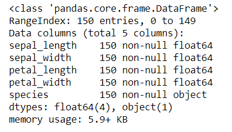
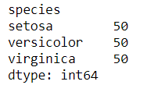
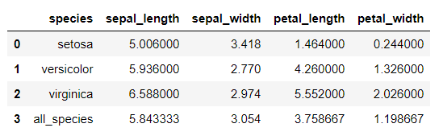

# Iris Dataset Project 2019
This repository contains an explanation and exploration of the famous Iris Dataset as part of the assessment in the  Programming and Scripting module for the Higher Diploma on Data Analytics with Galway-Mayo Institute of Technology.
 
## 1. About this Repository
The repository is made up of the following files and folders:
* A **README** file that contains descriptions of the Iris Dataset, exploratory data analysis using statistics and visualisation, and a very basic illustration of how the dataset can be used in machine learning.
* The **iris.csv** file which contains the complete dataset downloaded from [here](https://gist.github.com/curran/a08a1080b88344b0c8a7#file-iris-csv-L1). Note that there have been slight discrepancies observed in some electronic versions of the dataset with small variations observed when compared to the original dataset that was published in 1936 (Bezdek et al, 1999) but these differences are not substantial enough to have any major effect on the overall patterns in the dataset.
* Two **Jupyter Notebooks** created using Python: 
    * **Iris Dataset Exploratory Data Analysis** uses the *pandas* library for statistical investigations and *matplotlib* and *seaborn* for data visualisation.
    * **Machine Learning** that interprets the dataset as *numpy* arrays and builds a basic model using *sklearn*, specifically the *K-Nearest Neighbor* algorithm. 
* **Images** folder that contains .png files of some of the data visualisation performed in the Exploratory Data Analysis notebook that are embedded for description purposes in this README. 

## 2. Python Coding Methodology
As a novice in the Python language, this project challenged me to become familiar with several new libraries that have been widely used to investigate the dataset. For the exploratory portion of the project, I learned the basics of using the pandas library to read datasets ([Mester, 2019](https://data36.com/pandas-tutorial-1-basics-reading-data-files-dataframes-data-selection/), [Pandas-Docs](https://pandas.pydata.org/pandas-docs/stable/getting_started/10min.html)) as it is an excellent tool for data manipulation and statistics that is relatively easy to learn. To create graphs, I used a mixture of matplotlib and seaborn, which was developed based on matplotlib and creates more attractive graphs ([Mendis, 2019](https://www.kdnuggets.com/2019/04/data-visualization-python-matplotlib-seaborn.html)).

The machine learning portion of the project uses scikit-learn which is built to interpret a dataset as a numpy array rather than through pandas. Scikit-learn is a very powerful but quite a complex library - at least to a beginner - so I used several resources in an attempt to understand some of its basic functionality ([Codesbay, 2018](https://www.youtube.com/watch?v=hd1W4CyPX58&); [Markham, 2018](https://github.com/justmarkham/scikit-learn-videos/blob/master/04_model_training.ipynb); [Ng, 2019](https://www.ritchieng.com/machine-learning-iris-dataset/#)). For the purposes of this investigation, I attempted to create a very basic illustration of a potential machine learning programming using the K-Nearest Neighbors algorithm, which I found the most accessible to a new user. 

Rather than presenting the code generated for this project as a series of .py files, I decided to learn how to use a Jupyter Notebook for code presentation as output is presented in a much cleaner fashion and is altogether more legible.

## 3. The Dataset
The Iris Dataset consists of 50 samples each of three different species of iris flower: *setosa*, *versicolor* and *virginica*. It contains four different measurements for each sample in centimetres - the length and width of sepals and petals - making it a multivariate dataset.

The data was collected by botanist Edgar Anderson in the Gaspé Peninsula and popularised when it was used by biologist and statistician Ronald Fisher in his 1936 paper *The Use of Multiple Measurements in Taxonomic Problems* to demonstrate how statistics can be used for classification. He argues that, based on some significant attribute differences between the species in this dataset, iris group membership could potentially be determined by sepal and petal measurements alone - a method that would become known as linear discriminant analysis - and that new iris flowers could be classified based on the statistical information gleaned from the dataset. 

The Iris Dataset remains a commonly used example as an introduction to exploratory data analysis, pattern recognition, and machine learning algorithms for the following reasons:
* It is a complete, balanced dataset in that there are no null values and each class is equally represented. 
* Each of the four features (sepal and petal length and width) are measured in the same units (centimetres).
* One iris species (setosa) is linearly separable from the other two. While the other species have some overlap, they are still largely distinguishable from one another in some measurements. Thus, classification is relatively easy and, by extension, the predictive capability of the data is quite strong. 

## 4. Exploratory Data Analysis
*To be read in conjunction with Jupyter Notebook entitled **Iris Dataset Exploratory Analysis***

The following resources were used to develop a familiarity with the pandas library and previous exploratory analysis of the dataset:
https://medium.com/@harimittapalli/exploratory-data-analysis-iris-dataset-9920ea439a3e
https://www.kaggle.com/lalitharajesh/iris-dataset-exploratory-data-analysis
https://machinelearningmastery.com/machine-learning-in-python-step-by-step/
https://www.ritchieng.com/machine-learning-iris-dataset/
https://github.com/ashKadam/IrisDataAnalysis/blob/master/Iris.py
https://datahero.com/blog/2013/11/20/5-beginners-steps-to-investigating-your-dataset/
https://www.quora.com/What-are-the-steps-include-in-data-exploration

Exploratory Data Analysis allows us to better understand the data through statistical and visual techniques in order to form hypotheses and uncover potential patterns in the data. 
 
Generally, the first things to look at when confronted with a new dataset are the structure of the dataset and basic information about its contents (Refs). Pandas allows us to see that the dataset is comprised of 150 rows and 5 columns; 4 of these columns are float datatypes containing the petal and sepal measurements and the last one is an object datatype that contains the species names. There are no null values in the dataset that need to be accounted for in later analysis. We can also see that the dataset is well balanced with each species accounting for 50 samples.
              

## Averages and Standard Deviations
Simply observing the averages of each measurement by species seems to demonstrate significant differences between the species. For instance, setosa has the smallest sepal length, petal length and petal width measurements and yet the largest sepal widths.
None of the species individual averages are close to the overall average for all species.
The difference between species seems much more pronounced for petal measurements than sepal measurements 

Standard Deviation
How close measurements are the to average - how wide is the bell curve? Is there even a bell curve? Is the data normally distributed?

## Correlations
Correlation figures demonstrate that petal length and petal width are both highly correlated with sepal length
Petal length and width are very highly correlated
However, sepal width is not highly correlated with any other measurement. The smallest correlation is between sepal length and width, suggesting that they can be vastly different. When we were previously looking at averages, we saw that the species setosa has the smallest average measurements in petal length and width and in sepal length and yet had the largest average sepal width. 
?Look at particular correlations between species to see if setosa is affecting these figures. 

## Visualising the Data
Data visualisation helps us to identify interesting aspects of the data in a more clean and efficient manner than just looking at numbers.

Univariate plots help us to understand each individual attribute (e.g. histograms, box plots while multivariate allows us to visualise the relationships between the attributes (e.g. scatter plots). https://machinelearningmastery.com/machine-learning-in-python-step-by-step/

## Pairplots
A look at the pairplot below shows that iris setosa (shown in blue) appears visually to be quite separate from the other two species. While there is quite a bit of observable overlap between versicolor and virginica, particularly in terms of sepal measurements, setosa appears to the significantly distinct. Petal length and width in the setosa are significantly smaller than either versicolor or virginica.
 

### Scatterplots
The scatterplots show how sepal and petal lengths and widths relate to one another. 

Petal measurements are much more congruent than sepal measurements

The scatterplots show how one species of iris, the Setosa, is almost entirely distinct from the other two species. A straight line could be drawn to separate the sepal and petal measurements of Setosa from those of the other species, and this difference is particularly evident with petal measurements. 

If one sees an iris with short, narrow petals and short but wide sepals, it could be reliably predicted that the particular species is Setosa.  

Versicolor and Virginica are not very distinguishable from one another in terms of sepal measurements but looking at the petal data, Virginica irises seem more likely to have longer, wider petals than Versicolor.

 

The histograms and scatterplots shown in the pairplot, allow us to see at a glance how separable the setosa data is from the other two iris species across all measurements. 
While iris versicolor and virginica are not as distinct from one another, the pairplots show that they are more separable by petal measurements than sepal measurements. 

## 5. Machine Learning
The patterns identified in the exploratory data analysis portion of this project demonstrate why the Iris Dataset is a popular choice for machine learning tutorials; the separability of the species makes the building of a predictive model relatively easy. A machine learning program learns from data provided by previous examples. In the case of the Iris Dataset, this is a supervised learning problem as the example provides both input (iris measurements) and output (iris species) pairs ([Markham, 2018](https://www.youtube.com/watch?v=hd1W4CyPX58&)). The information from these pairings should ideally allow us to create a model that can accurately predict a species of iris when presented with new data inputs. 

There are several steps in the construction of a supervised machine learning program that have been outlined well by [Guo (2017)](https://towardsdatascience.com/the-7-steps-of-machine-learning-2877d7e5548e) and which I will address individually below:
1. Data collection.
2. Data preparation.
3. Choose a model.
4. Train the model.
5. Evaluate the model.
6. Parameter tuning
7. Make predictions.

### 5.1 Data Collection.
In this case, I am using a pre-existing dataset and so the data collection step is unnecessary.

### 5.2 Data Preparation.
This involves cleaning up the data, if required - removing errors/duplicates and dealing with null values, which is not necessary with the Iris Dataset - and performing exploratory data analysis, completed in the previous section. 

It also involves the splitting of the data into a training set and a testing/validation set - a portion that will be used to train the model and a smaller portion that will be used to test the resulting model. There is no correct training/testing ratio but in general a [70/30 split](https://www.researchgate.net/post/Is_there_an_ideal_ratio_between_a_training_set_and_validation_set_Which_trade-off_would_you_suggest) is adopted. However, this depends on the dataset being used and it is best to test different ratios to see which fits best with the particular dataset and yields the most accurate predictions. Previous models with the Iris Dataset have used a 50/50 split ([Sharma, 2017](https://www.kaggle.com/sharmajayesh76/iris-data-train-test-split)), 60/40 split ([Rajesh, 2018](https://www.kaggle.com/lalitharajesh/iris-dataset-exploratory-data-analysis)), 90/10 split ([Reitz, 2016](https://python-guide-kr.readthedocs.io/ko/latest/scenarios/ml.html)), 80/20 split ([Brownlee, 2016](https://machinelearningmastery.com/machine-learning-in-python-step-by-step/); [Ogundowole, 2017](https://medium.com/codebagng/basic-analysis-of-the-iris-data-set-using-python-2995618a6342)) or 70/30 split ([Kausar, 2018](https://www.kaggle.com/kamrankausar/iris-dataset-ml-and-deep-learning-from-scratch)). In this project, I checked both a 70/30 split as it is considered the norm and an 80/20 split as it is used in two of the examples.

The data is split into x values that represent the measurements (iris.data) and y values that represent the species (iris.target). These x and y numpy arrays are then split into training (x_train, y_train) and testing (x_test, y_test) sets and the test_size is set to 0.2/0.3.

### 5.3 Choose a Model
Scikit-learn is a popular Python library used for creating machine learning models. Indeed all of the previous Iris Dataset models I have explored use scikit-learn. There are several algorithms available in this library that can be used to build a machine learning model for the Iris Dataset including:
* Logistic Regression
* Linear Discriminant Analysis
* K-Nearest Neighbors
* Classification and Regression Trees 
* Gaussian Naive Baynes
* Support Vector Models

Some previous models test each model for accuracy before settling on one or more for their own models ([Brownlee, 2016](https://machinelearningmastery.com/machine-learning-in-python-step-by-step/); [Kauser, 2018](https://www.kaggle.com/kamrankausar/iris-dataset-ml-and-deep-learning-from-scratch); [Ogundowole, 2017](https://medium.com/codebagng/basic-analysis-of-the-iris-data-set-using-python-2995618a6342)) and, because the dataset is such an excellent predictive model, they all rank quite high, between 96%-99%.

For the purposes of the current investigation, I will be using a K-Nearest Neighbors model to illustrate how one may go about constructing a machine learning model as I found it the most accessible tool to understand and utilise.

### 5.4 Train the Model: K-Nearest Neighbor (KNN) 
KNN can be used for classification prediction models and so is fitting for the Iris Dataset. A KNN model is built with a dataset that contains input features and output labels and, when presented with new data, uses Euclidean Distance to measure the distance between the new data points and a number of established data points. The number of data points, called 'K', can be adjusted based on the size of the dataset. If the majority of data points nearest the new data point match a particular species, the model will ascertain that the new measurements presented belong to that species. 

The image below demonstrates KNN classification that checks two different K values. In the first instance (K = 3) the model would check the 3 nearest neighbours and determine that the new data point belongs to Class B. However, if the KNN is expanded (K = 7), allowing the model to check the 7 nearest neighbours, the new data point is likely to belong to Class A.

There is [no ideal value for K](https://discuss.analyticsvidhya.com/t/how-to-choose-the-value-of-k-in-knn-algorithm/2606/13) that make a model most accurate. It is advisable to try different values for K to see what returns the most accurate predictions. In the table below, I have tested 10 different K values 10 different times and chose the K value of 13 based on the mean accuracy percentage.

It is generally advisable to make the value of K an odd number rather than an even number as this lowers the chance of there being an equal number of data points ([Codesbay, 2018](https://www.youtube.com/watch?v=kzjDUr-7uRw)).

The KNN fit function trains the model which can then be checked with the predict function and the test data.

### 5.5 Evaluate the Model
The model is evaluated using the accuracy_score function that is available through the metrics module of the scikit-learn library. This measurement changes each time the model is run.

### 5.6 Parameter Tuning
Determining K values and test percentage

### 5.7 Make Predictions#
Using new numpy arrays to check model.

It is worth noting that KNN is useful as an introduction to machine learning models but it does not strictly speaking create a model that is trained to interpret data. It runs through the dataset for each and every prediction meaning it [consumes a lot of time and space](https://stackoverflow.com/questions/10814731/knn-training-testing-and-validation). 

## 6. Conclusion

## 7. References
Bezdek, J. C., Keller, J. M., Krishnapuram, R., Kuncheva, L. I., & Pal, N. R. (1999) *Correspondence: Will the Real Iris Data Please Stand Up?*. IEEE Transactions on Fuzzy Systems, 7: 3, June 1999.

Brownlee, J. (2016) *Your First Machine Learning Project in Python Step-by-Step.* https://machinelearningmastery.com/machine-learning-in-python-step-by-step/

Codesbay (2018). *Machine Learning 'Hello World' with Scikit Learn: Chapter 5: Using the Iris Dataset.* YouTube. https://www.youtube.com/watch?v=kzjDUr-7uRw

Fisher, R. A. (1936) *The Use of Multiple Measurements in Taxonomic Problems.* Annals of Eugenics, 7.2. 

Guo, Y. (2017) *The 7 Steps of Machine Learning.* Towards Data Science. https://towardsdatascience.com/the-7-steps-of-machine-learning-2877d7e5548e

Kadam, A. (2017) *Iris Data Analysis*. GitHub Repository https://github.com/ashKadam/IrisDataAnalysis/blob/master/Iris.py

Kausar K. (2018) *Iris Dataset ML and Deep Learning from Scratch.* Kaggle Notebook. https://www.kaggle.com/kamrankausar/iris-dataset-ml-and-deep-learning-from-scratch/notebook 

Markham, K. (2018) *Training a MAchine Learning Model with Scikit-Learn - Video 4.* Github Repository. https://github.com/justmarkham/scikit-learn-videos/blob/master/04_model_training.ipynb and paired Youtube Video https://www.youtube.com/watch?v=hd1W4CyPX58&.

Mendis, A. (2019) *Data Visualization in Python: Matplotlib vs Seaborn.* KDnuggets. https://www.kdnuggets.com/2019/04/data-visualization-python-matplotlib-seaborn.html

Mester, T. (2018). Pandas Tutorial Series. [Part 1](https://data36.com/pandas-tutorial-1-basics-reading-data-files-dataframes-data-selection/), [Part 2](https://data36.com/pandas-tutorial-2-aggregation-and-grouping/), [Part 3](https://data36.com/pandas-tutorial-3-important-data-formatting-methods-merge-sort-reset_index-fillna/).

Mittapalli, H. (2018) *Exploratory Data Analysis.* Medium. https://medium.com/@harimittapalli/exploratory-data-analysis-iris-dataset-9920ea439a3e

Ng, R. (2019) *Iris Dataset.* https://www.ritchieng.com/machine-learning-iris-dataset/#

Ogundowole, O. O. (2017) *Basic Analysis of the Iris Dataset Using Python.* Medium. https://medium.com/codebagng/basic-analysis-of-the-iris-data-set-using-python-2995618a6342

Pandas-Docs (2019) *10 Minutes to Pandas.* https://pandas.pydata.org/pandas-docs/stable/getting_started/10min.html

Rajesh, L. (2018) *Iris Dataset - Exploratory Data Analysis.* Kaggle Notebook. https://www.kaggle.com/lalitharajesh/iris-dataset-exploratory-data-analysis

Reitz, K. (2016) *Machine Learning.* https://python-guide-kr.readthedocs.io/ko/latest/scenarios/ml.html

Sharma, J. (2017) *Iris Data Train_Test_Split.* Kaggle Notebook. https://www.kaggle.com/sharmajayesh76/iris-data-train-test-split

Further Links:
Train-test-split ratio https://www.researchgate.net/post/Is_there_an_ideal_ratio_between_a_training_set_and_validation_set_Which_trade-off_would_you_suggest
Ideal value of K: https://discuss.analyticsvidhya.com/t/how-to-choose-the-value-of-k-in-knn-algorithm/2606/13
KNN as a machine learning model: https://stackoverflow.com/questions/10814731/knn-training-testing-and-validation

# Notes

Brownlee (2016):
A machine learning project may not be linear, but it has a number of well known steps:
1. Define Problem.
2. Prepare Data.
3. Evaluate Algorithms.
4. Improve Results.
5. Present Results.

The best small project to start with on a new tool is the classification of iris flowers (e.g. the iris dataset). This is a good project because it is so well understood.
* Attributes are numeric so you have to figure out how to load and handle data.
* It is a classification problem, allowing you to practice with perhaps an easier type of supervised learning algorithm.
* It is a multi-class classification problem (multi-nominal) that may require some specialized handling.
* It only has 4 attributes and 150 rows, meaning it is small and easily fits into memory (and a screen or A4 page).
* All of the numeric attributes are in the same units and the same scale, not requiring any special scaling or transforms to get started.

Look at the dataset in terms of: 
* Classification - organising data by categories
* Linear discriminant analysis 
* Clustering
* Data visualisation - graphs
* Pattern recognition - species could be predicted based on data measurements
* Machine learning such as neural networks - predictive nature of the data 